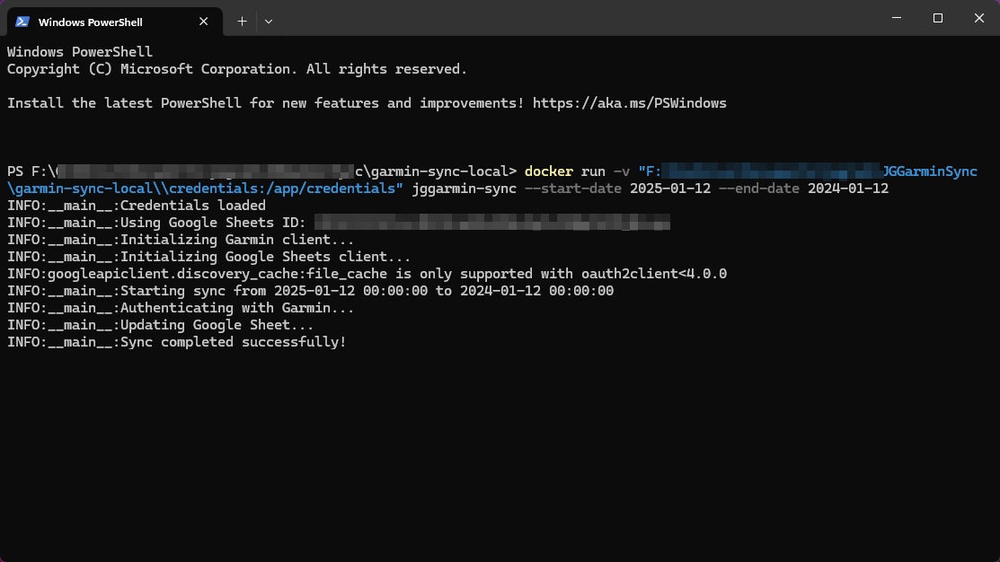

# Garmin Data to Google Sheets Utility

A Docker-based command-line tool that pulls daily health metrics from Garmin Connect and stores them in Google Sheets.

I created this utility to feed data into an LLM (e.g. Claude, ChatGPT, or Gemini) so that I could gain insights for improving my health and longevity.

## Screenshots

Running the utility in PowerShell:

*Simple command line utility to pull daily data from Garmin and store it in a Google Sheet.*

The result:

*Your Garmin data is now in a Google Sheet ready for additional analysis.*

## Prerequisites

- Docker installed on your system or Python 3.9 or higher (if running without Docker)
- A Garmin Connect account
- A Google account with access to Google Sheets

Note: some users have reported challenges with the refreshing auth tokens in the Docker version of this app. If you face this, instead run the app directly with Python (see below after step 4).

## Setup Instructions

### 1. Clone the Repository
```bash
git clone https://github.com/yourusername/garmin-sync.git
cd garmin-sync
```

### 2. Set Up Google Sheets API

1. Go to the [Google Cloud Console](https://console.cloud.google.com/)
2. Create a new project or select an existing one
3. Enable the Google Sheets API for your project
4. Create credentials (OAuth 2.0 Client ID):
   - Click "Create Credentials" > "OAuth client ID"
   - Choose "Desktop app" as the application type
   - Download the client configuration file
5. Create a new directory called `credentials` in the project root
6. Move the downloaded file into the `credentials` directory and rename it to `client_secret.json`

### 3. Configure Environment Variables

1.  **Copy the Example File:** Create a `.env` file by copying the example:
    ```bash
    cp .env.example .env
    ```

2.  **Edit `.env`:** Open the `.env` file and populate it with the details for each user profile you want to sync. Follow the `USER<N>_` prefix convention shown in `.env.example`:

    ```dotenv
    # User Profile 1
    USER1_GARMIN_EMAIL=user1@example.com
    USER1_GARMIN_PASSWORD=password1
    USER1_SHEET_ID=sheet_id_1

    # User Profile 2
    USER2_GARMIN_EMAIL=user2@example.com
    USER2_GARMIN_PASSWORD=password2
    USER2_SHEET_ID=sheet_id_2
    # Add more users as needed following the USER<N>_ prefix pattern

    # Google API Credentials (shared, point to your downloaded files)
    GOOGLE_CLIENT_SECRET_PATH=credentials/client_secret.json
    GOOGLE_TOKEN_PATH=credentials/token.pickle
    ```

    *   Replace the example emails, passwords, and sheet IDs with your actual Garmin Connect credentials and the Google Sheet ID for *each user*.
    *   The `GOOGLE_CLIENT_SECRET_PATH` and `GOOGLE_TOKEN_PATH` usually don't need changing if you followed Step 2 (Google Sheets API Setup).

3.  **Get Google Sheet IDs:** For each user's sheet:
    *   Create a new Google Sheet or use an existing one.
    *   The Sheet ID is part of the URL: `https://docs.google.com/spreadsheets/d/[THIS-IS-YOUR-SHEET-ID]/edit`
    *   Copy this ID into the corresponding `USER<N>_SHEET_ID` field in your `.env` file.

### 4. Build and Run with Docker

1. Build the Docker image:
```bash
docker build -t garmin-sync .
```

2.  **Run the Sync Tool:**
    ```bash
    # Make sure your .env file is in the current directory
    # Mount the credentials directory and the .env file
    docker run -v $(pwd)/credentials:/app/credentials -v $(pwd)/.env:/app/.env garmin-sync
    ```
    The tool will now run interactively:
    *   It will list the user profiles found in your `.env` file and prompt you to select one.
    *   It will then ask for the `Start Date` (YYYY-MM-DD format).
    *   Finally, it will ask for the `End Date` (YYYY-MM-DD format).

    The data for the selected user and date range will be synced to their specified Google Sheet.

### Running Without Docker

These steps are only if you prefer not to use Docker. This is more complex and not tested.

1. Create a virtual environment:
```bash
python -m venv venv
source venv/bin/activate  # On Windows: venv\Scripts\activate
```

2. Install dependencies:
```bash
pip install -r requirements.txt
```

3.  **Run the Sync Tool:**
    ```bash
    # Make sure your .env file is in the project root directory
    python -m src.main
    ```
    The tool will now run interactively:
    *   It will list the user profiles found in your `.env` file and prompt you to select one.
    *   It will then ask for the `Start Date` (YYYY-MM-DD format).
    *   Finally, it will ask for the `End Date` (YYYY-MM-DD format).

    The data for the selected user and date range will be synced to their specified Google Sheet.

## Available Metrics

The tool syncs the following daily metrics from Garmin Connect:
- Sleep Score
- Sleep Length
- Weight
- Body Fat Percentage
- Blood Pressure (Systolic/Diastolic)
- Active/Resting Calories
- Resting Heart Rate
- Average Stress
- Training Status
- VO2 Max (Running/Cycling)
- Intensity Minutes
- Activity Counts and Distances/Durations (Running, Cycling, Strength, Cardio)

These metrics were chosen specifically because they relate to long-term health and longevity planning.

## Troubleshooting

1. Authentication Issues:
   - Ensure your Garmin credentials are correct in `.env`
   - For Google Sheets issues, delete `token.pickle` and try again

2. Permission Issues:
   - Ensure the credentials directory is mounted correctly in Docker
   - Check that your Google account has edit access to the sheet

## Security Notes

- Never commit your `.env` file or anything in the `credentials` directory
- Keep your Google client secret and credentials secure
- The tool uses environment variables for all sensitive data

## Known Issues

Data prior to May 14, 2023 does not work with this tool yet. If you put earlier dates, the utility will just create blank rows.

## License

This project is licensed under the MIT License - see the [LICENSE.md](LICENSE.md) file for details.
